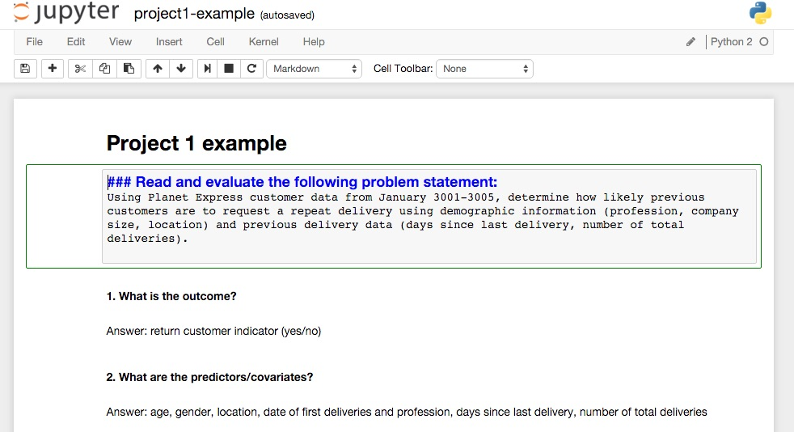

#  Project #1: Research Design Write-Up
DS | Unit Project 1

### PROMPT

"A problem well-stated is half-solved" -- Charles Kettering

Welcome to Data Science! In this first project you will create a framework to scope out data science projects. This framework will provide you with a guide to develop a well-articulated problem statement and analysis plan that will be robust and reproducible.

**Goal:** Create a structured iPython notebook using markup

Note: You'll be working with two scenarios in this project and one dataset.

---

### DELIVERABLES

#### Completed iPython Notebook

- **Requirements:**
    - Identify features of the dataset, including the outcome and covariates/predictors
    - Create a data dictionary with classification of available variables
    - Write a high quality problem statement
    - State the risks and assumptions of your data
    - Outline exploratory analysis methods

- **Bonus:**
    - Practice writing an alternative problem statement for your dataset
    - Articulate the risks and assumptions of this alternative model

- **Submission:**
    - TBD by Instructor 

---

### TIMELINE

| Deadline | Deliverable| Description |
|:-:|---|---|
| Lesson 3 | Project 1  | Research Design Write-Up   |

---

### EVALUATION

Your project will be assessed using the following standards:

1. Identify the Problem

#### Rubric: [Click here for the complete rubric](./project1-rubric.md). 

Requirements for these standards will be assessed using the scale below:

    Score | Expectations
    ----- | ------------
    **0** | _Incomplete._
    **1** | _Does not meet expectations._
    **2** | _Meets expectations, good job!_
    **3** | _Exceeds expectations, you wonderful creature, you!_

While your total score is a helpful gauge of whether you've met overall project goals, __specific scores are more important__ since they'll show you where to focus your efforts in the future!

---

### RESOURCES

#### Dataset  
We'll be using the same dataset as UCLA's Logistic Regression in R tutorial to explore logistic regression in Python, as explained in [yhat's blog](http://blog.yhat.com/posts/logistic-regression-and-python.html). This is an excellent resource for using logistic regression and summary statistics to explore a relevant dataset. Our goal will be to identify the various factors that may influence admission into graduate school. It contains four variables- admit, gre, gpa, rank.

- 'admit' is a binary variable. It indicates whether or not a candidate was admitted admit =1) our not (admit= 0)
- 'gre' is GRE score
- 'gpa' stands for Grade Point Average
- 'rank' is the rank of an applicant's undergraduate alma mater, with 1 being the highest and 4 as the lowest

Dataset: [Admissions.csv](./assets/admissions.csv)

#### Starter code
For this project we will be using an iPython notebook. Notebooks are a handy way to communicate your research with your team and share your analysis. Using markup syntax will allow you create more visually appealing notebooks.

* Open the [starter code instructions](./starter-code/project1-starter.ipynb) in iPython notebook.

#### Sample Deliverables 
Check out the example notebook in our starter code, which includes a data dictionary and responses to questions. Wonder how to format your notebook the same way? Simply double-click on any section to view the markdown.

#### Suggestions for Getting Started 

- Get used to the iPython Notebook layout. Play around with keyboard shortcuts.
- Try out basic markdown for commonly used formats; look up commands for headers, bold, italic, tables.
- **Read the docs for iPython Notebooks.** Most of the time, there is a tutorial that you can follow, but not always, and learning to read documentation is crucial to your success as a data scientist!

### Additional Links

- [iPython Notebook Shortcuts](https://ipython.org/ipython-doc/1/interactive/notebook.html#keyboard-shortcuts)
- [Markdown Cheat Sheet](https://github.com/adam-p/markdown-here/wiki/Markdown-Cheatsheet)
- [iPython Notebook Docs](http://ipython.readthedocs.org/en/stable/)

---
